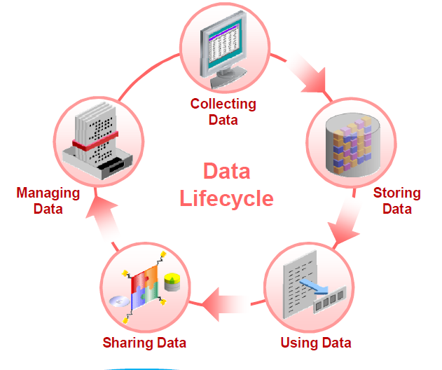

# Oracle database 12c Information Lifecycle Management

## 1. What is ILM ?

### 1-1. the concept of ILM

Information Lifecycle Management (ILM) is a strategy for managing business data over its lifetime.

 - To reduce storage costs
    compress
    move to low cost tablespace
    purge unnecessary rows

 - To improve data access
    partition
    move to  high cost tablespace

### 1-2. the solution of ILM

Prior to 12c, DBA has to perform the follow jobs periodically in offine/online time.
 - Plan the lifetime policy per data.
 - Paritionize the target tables.
 - Creating indexes locally or globally.
 - Add New partitions or Remove Old partitions with statistics informations.
 - Optionally Compress rarely used paritions.
 - Moving data to low cost tablespace or other database.
 - Performing a archival(long term) backup.

In 12c, you can operate Above ILM jobs automatically using the following features.

 - Heat Map
 - ADO(Automatic Data Optimization)
 - Paritioning enhancements
 - Compression enhancements

## 2. Licensing information

 - Oracle Partitioning : 
 
    EE and EE-Exa: Extra cost option

 - Heat Map :

    EE and EE-Exa: Requires the Advanced Compression option or the Database In-Memory option (Extra cost options)

 - Automatic Data Optimization :

    EE and EE-Exa: Requires the Advanced Compression option or the Database In-Memory option (Extra cost options)

 - Basic Table Compression : EE or higher (no extra cost option)

 - Oracle Advanced Compression
    
    EE and EE-Exa: Extra cost option

 - Advanced Index Compression

    EE and EE-Exa: Requires the Advanced Compression option

 - Hybrid Columnar Compression

    EE: Requires ZFS, Axiom, or FS1 storage

## 3. Heat Map and Automatic Data Optimization

Heat map : Oracle database 12c includes activity tracking with Heat Map providing the ability to track and mark data as it goes through life cycle changes
 - Data accesses at segment level
 - Data modifications at block and segment levels

Block-level and segment-level statistics  collected in memory are stored in tables in the SYSAUX tablespce.

ADO : Allows you to create policies that use Heat Map statistics to compress and move data only when necessary 
ADO automatically evaluates and executes policies that perform compression and storage tiering actions.

Components of  Heat Map and ADO

 - Data classification
   scope  (tbs level, segment level, row-level
   
 - Automatic Detection(Tracking)
   tracking target operation :  creation, access , modification
   tracking time : After n days/years or tbs full

 - Automatic Action
   compression
   move to other tablespces
   both compress + move

the process to set up Heat map and ADO
picture

ADO policies automatically compress data when it qualifies.
ADO policies automatically move segments when necessary.
ADO is dependent on Heat Map, and will not work unless Heat Map is enabled.

storage tiering read only 추가

enable/diable ado policy per table

ado on/off  database level

stop heat map

clear  heap map stats

## 4. Partitioning enhancements

 Partitioning allows the big segments like tables or indexes to be subdivided into smaller pieces.
 It provides an enhanced I/O performance and easier manageability.
 

12.1
online move partition
(move/split/merge/compress)
DML allowed, not DDL
global and local indexes maintained

12.1.0.2
interval reference paritioning

12.2

auto-list partitioning

composite partitioning enhancement

multicolumn list partitioning

read-only partition

filtered partition maintenance operations

when move, split perge parition
you can use  where (filter condition)

 
## 5. Compression enhancements

12.1
그대로

12.2 

## 6. Customized Evaluation and Execution and Monitoring(DBMS_ILM)
그대로