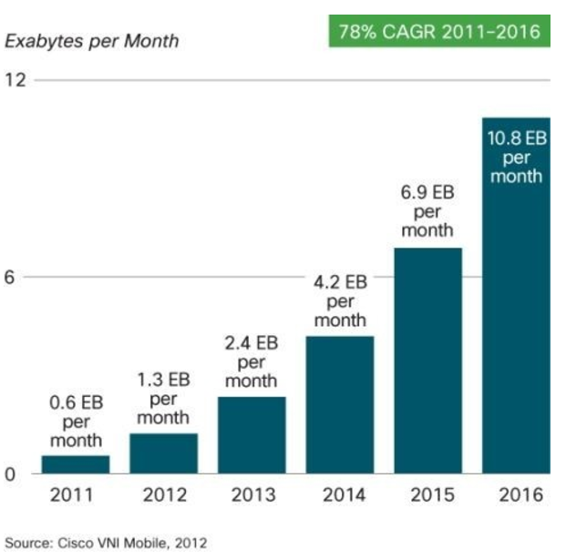

# Oracle Database 12c New feature series

## In-Memory Column Store

### 1. What is an In-Memory Database

Data explosion.

LIst of INDB solutions

|Vendor|Solution|
|-----|-----|
|SAP|HANA, ASE|
|Oracle| TimesTen, Oracle 12c|
|IBM|SolidDB, BLU|
|Microsoft|SQL Server|
|Altibase|Altibase|
|Sunje soft|SunDB|
|Etc|Pivotal,VoltDB,Aerospike,MemSQL,Teradata,Kognito,Exasol etc|

 - Column oriented database

 - Full data memory caching

### 2. Oracle In-Memory Column Store

Goal

benefit

### 3. Licensing information

### 4. IM Column Store architecture

### 5. New process and init param

### 6. Deploying IM column store

setting objects
testing query performance

DML and imct

recommendation

### In-memory caching

full db caching

big table caching
(Auto mode)

12.2 NF

set dynamic param  im_memory_size

im faststart

query table : join groups

cu  to enable  expression, virtual columns

### References
 - [Oracle Help center : https://docs.oracle.com](https://docs.oracle.com)

 - [Exam : http://exem.tistory.com/771](http://exem.tistory.com/771)