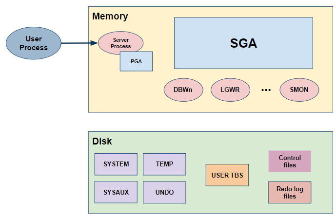
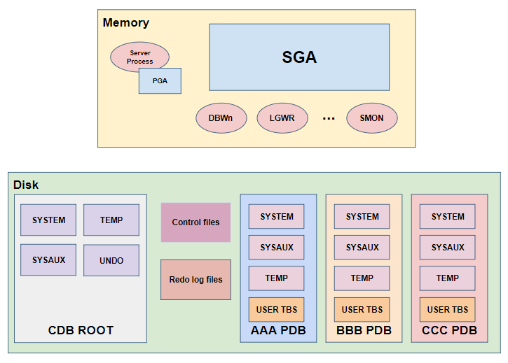
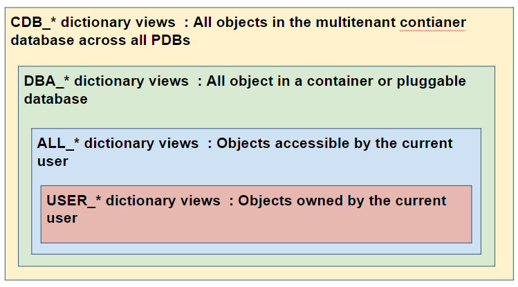
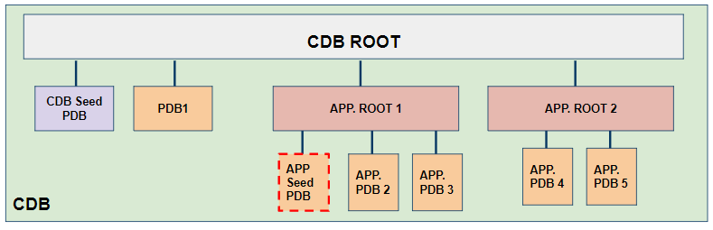

# Oracle Database 12c New feature series

## Multitenant

### 1. Licensing information

- For all offerings, if you are not licensed for Oracle Multitenant, then the container database architecture is available in single-tenant mode, that is, with one user-created PDB, one user-created application root, and one user-created proxy PDB. 
- EE: Extra cost option; if you are licensed for Oracle Multitenant, then you can create up to 252 PDBs.
- EE-Exa: Extra cost option; if you are licensed for Oracle Multitenant, then you can create up to 4096 PDBs. (12.2 NF)
- DBCS EE-HP, DBCS EE-EP, and ExaCS: Included option; you can create up to 4096 PDBs. (12.2 NF)

### 2. 12c Release 1 New features

#### 2-1. Multitenant architecture

In Oracle 11g R2, <br/>
Multiple databases share nothing within the single consolidation server.
 * Too many background processes
 * High shared/process memory (SGA/PGA)
 * Many copies of Oracle Metadata
 


In Oracle 12c,<br/>
A multitenant environment enables the central management of multiple PDBs in a single installation and enables you to accomplish several goals.
 * Less then Instance resources(BG processes and memory usage)
 * provides isolation between PDBs
 * Share Oracle-supplied dictionary objects(metadata)


#### 2-2. The purpose of multitenant environment

 * Cost reduction <br/> 
 By consolidating hardware and database infrastructure to a single set of background processes, and efficiently sharing computational and memory resources, you reduce costs for hardware and maintenance.

 * Easier and more rapid movement of data and code <br/>
 By design, you can plug a PDB into a CDB, unplug the PDB from the CDB, and then plug this PDB into a different CDB. Therefore, you can easily move an application's database back end from one server to another.

 * Easier management and monitoring of the physical database <br/>
 The CDB administrator can manage the environment as an aggregate by executing a single operation, such as patching or performing an RMAN backup, for all hosted tenants and the CDB root.

 * Separation of data and code <br/>
 Although consolidated into a single physical CDB, PDBs mimic the behavior of traditional non-CDBs. For example, a PDB administrator can flush the shared pool or buffer cache in the context of a PDB without affecting other PDBs in the CDB.

 * Fewer patches and upgrades : It is easier to apply a patch to one CDB than to multiple non-CDBs and to upgrade one CDB than to upgrade several non-CDBs.

 * To change the DB configuration easier <br/>
 It can be changed easire between RAC, single , ADG and etc.

#### 2-3. Components of a CDB
CDB is the Parent Container Database in a multitenant environment. It is physical instance by itself. Its container ID is 0 

A CDB includes the following components(containers):

 - Root
 
 The root, named CDB$ROOT, stores Oracle-supplied metadata and common users. An example of metadata is the source code for Oracle-supplied PL/SQL packages. A common user is a database user known in every container. A CDB has exactly one root. Its container ID is 1

 - Seed
 
 The seed, named PDB$SEED, is a template that you can use to create new PDBs. You cannot add objects to or modify objects in the seed. A CDB has exactly one seed. Its container ID is 2

- PDBs

A PDB appears to users and applications as if it were a non-CDB. For example, a PDB can contain the data and code required to support a specific application. A PDB is fully backward compatible with Oracle Database releases before Oracle Database 12c.
(Maximum available PDBs : 253 include Seed PDB)

#### 2-4. Configurations of multitenant container database.
There are 3 possible configurations in oracle database 12c.
 * multitenant environment : 1 CDB and more then 1 PDBs
 * singletenant environment : 1 CDB and 1 PDB (no extra cost)
 * non-CDB : like the classical 11g DB

 Multitenent container database consists of


 Seperating SYSTEM and USER DATA

 Shared Resources
 - Instance(SGA and Background processes)
 - Control files and Redo log files(online/archived)
 - ADR(Automatic Diagnostic Repository : alert log file etc)
 - Parameter file(SPfile/Pfile) and Password file
 - Oracle Net configuration files(listener.ora, sqlnet.ora, tnsnames.ora)
 - UNDO tablespace per CDB instance
 - Default temporary tablespace
 - Chacracterset per CDB instance(Unicode recommended)
 - AWR(Automatic Workload Repository)
 - Common Objects(including PL/SQL) : Oracle-supplied object like OBJ$,TAB$ etc

 Non-shared Resources
 - SYSTEM, SYSAUX tablespace : oracle supplied objects pointing to Root containers's Dictionary
 - Local temporary tablespace (optional)
 - User tablespace
 - Local users and roles

#### 2-5. Creating a CDB

You can create a CDB using,
 - DBCA is a utility with a graphical user interface that enables you to configure a CDB, create PDBs, plug in PDBs, and unplug PDBs.

 - Oracle Enterprise Manager Cloud Control is a system management tool with a graphical user interface that enables you to manage and monitor a CDB and its PDBs.

 - Oracle SQL Developer is a graphical version of SQL*Plus that gives database developers a convenient way to perform basic tasks.

 - The Server Control (SRVCTL) utility can create and manage services for PDBs.

 - EM Express


Creating a CDB using DBCA


#### 2-1. Creating and Dropping a PDB
There are 4 ways to create a PDB in Oracle 12c.

 - Preparing for PDBs
 
 Prerequisites must be met before creating a PDB.

 - Creating a PDB Using the Seed
 
 You can use the CREATE PLUGGABLE DATABASE statement to create a PDB in a CDB using the files of the seed.

 - Creating a PDB by Cloning an Existing PDB or Non-CDB
 
 You can create a PDB by cloning a local PDB, a remote PDB, or a non-CDB.

 - Creating a PDB by Plugging an Unplugged PDB into a CDB
 
 You can create a PDB by plugging an unplugged PDB into a CDB.

 - Creating a PDB Using a Non-CDB 
 
 You can create a PDB using a non-CDB in different ways.

 - Unplugging a PDB from a CDB
 
 You can unplug a PDB from a CDB.

 - Dropping a PDB
 
 The DROP PLUGGABLE DATABASE statement drops a PDB. You can drop a PDB when you want to move the PDB from one CDB to another or when you no longer need the PDB.


#### 2-1. Managing a CDB and PDBs

- connecting a CDB and PDB

- Start and stop a CDB and PDB


- Multitenant data dictionary



- Shared and Non-shared Object

    * Metadata-linked object
   * Object-linked object

- Configuring an initialization parameter


#### 2-1. user and privileges (dictionary)


#### 2-1. backup and recovery

### 3. 12c Release 2 New features

#### 3-1. About Application containers

**Purpose of Application Containers**

 An application container, like the CDB itself, can include multiple PDBs, and enables these PDBs to share metadata and data.

The application root enables application PDBs to share an application, which in this context means a named, versioned set of common metadata and data. 

A typical application installs application common users, metadata-linked common objects, and data-linked common objects.

**Key Benefits of Application Containers**

Application containers provide several benefits over storing each application in a separate PDB.

The application root stores metadata and data that all application PDBs can share.

You maintain your master application definition in the application root, instead of maintaining a separate copy in each PDB.

If you upgrade the application in the application root, then the changes are automatically propagated to all application PDBs.

An application container can include an application seed, application PDBs, and proxy PDBs (which refer to PDBs in other CDBs).

You can rapidly create new application PDBs from the application seed.

You can query views that report on all PDBs in the application container.

While connected to the application root, you can use the CONTAINERS function to perform DML on objects in multiple PDBs.

You can unplug a PDB from an application root, and then plug it in to an application root in a higher Oracle database release. Thus, PDBs are useful in an Oracle database upgrade.

 **components of Application containers**
 - Application root
 - Application seed(optional)
 - Application PDBs




**Creating Application containers**

1. connect to the CDB Root
2. Create the PDB_APP1 as the application root and open it.

```
SQL> CONNECT / AS SYSDBA
SQL> CREATE PLUGGABLE DATABASE PDB_APP1
   AS APPLICATION CONTAINER
   ADMIN USER adminseed IDENTIFIED BY p1
   ROLES=(CONNECT)
   CREATE_FILE_DEST='/u02/oradata/pdb_app1_root';

SQL> ALTER PLUGGABLE DATABASE PDB_APP1 OPEN;
```
3. Optionally, create the application seed within the application root.
```
SQL> CONNECT sys@PDB_APP1 AS SYSDBA
SQL> CREATE PLUGGABLE DATABASE AS SEED 
ADMIN USER admin1 IDENTIFIED BY p1 
ROLES=(CONNECT)
CREATE_FILE_DEST='/u02/oradata/pdb_app1_root/pdb_app1_seed';
```

3. Connect to the PDB_APP1
4. create the PDB2 as an application PDB and open it.
```
SQL> CONNECT sys@PDB_APP1 AS SYSDBA
SQL> CREATE PLUGGABLE DATABASE PDB2
ADMIN USER admin2 IDENTIFIED BY p1
ROLES=(CONNECT)
CREATE_FILE_DEST='/u02/oradata/pdb_app1_root/pdb2';
```


**Application name and version**
Within an application container, an application is the named, versioned set of common data and metadata stored in the application root.

To install an application, execute ALTER PDB APPLICATION BEGIN INSTALL, then execute user-created SQL statements,then end by executing ALTER PDB APPLICATION END INSTALL.

An application might include a application common user, an application common object, or some multiple and combination of the preceding.

An application  has its own name  and a version number.

An application can alse be patched, upgraded and unintalled.


**Installing and Upgrading Application**
Installing

Connect to the PDB_APP1 application root.

Assign an application name and version number to the new APP1 application that is being installed

SQL> ALTER PLUGGABLE DATABASE APPLICATION APP1 
BEGIN INSTALL '1.0';

Execute the user-defined scripts (create  a table , a user or something)

SQL>@scripts

Finish the applicatin installation
SQL> ALTER PLUGGABLE DATABASE APPLICATION APP1
END INSTALL '1.0';

Synchronize each application PDB.


UPgrading
connect to the PDB_APP1 applicatin root of the APP1 application.

check the current version number of the APP1 application before starting the upgrade.

start the application upgrade to a higher version number.
SQL> ALTER PLUGGABLE DATABASE APPLICATION APP1 BEGIN UPGRADE '1.0' TO '1.1';

complete the application upgrade

SQL> @scripts
SQL> ALTER PLUGGABLE DATABASE APPLICATION APP1 END UPGRADE TO '1.1';


synchronize each application PDB.


**How an Application Upgrade Works**

During an application upgrade, the application remains available. To make this availability possible, Oracle Database clones the application root.

The following figure gives an overview of the application upgrade process.


**Creation of Application Common Objects**

To create common objects, connect to an application root, and then execute a CREATE statement that specifies a sharing attribute.

You can only create or change application common objects as part of an application installation, upgrade, or patch.

 - DEFAULT_SHARING initialization parameter :the default sharing attribute for all database objects created in the root.
 - SHARING clause : You specify this clause in the CREATE statement itself.(Possible values are METADATA, DATA, EXTENDED DATA, and NONE.)

Metadata-Linked Application Common Objects

A metadata link is a dictionary object that supports referring to, and granting privileges on, common metadata shared by all PDBs in the application container.

The metadata for the object is stored once in the application root.
(Tables, views, and code objects (such as PL/SQL procedures))

Typically, most objects in an application will be metadata-linked. Thus, you need only maintain one master application definition. This approach centralizes management of the application in multiple application PDBs.

Data-Linked Application Common Objects
A data-linked object is an object whose metadata and data reside in an application root, and are accessible from all application PDBs in this application container.

A data link is a dictionary object that functions much like a synonym. For example, if countries is an application common table, then all application PDBs access the same copy of this table by means of a data link. If a row is added to this table, then this row is visible in all application PDBs.

A data link must be owned by an application common user. 

For example, if an application container contains 10 application PDBs, and if every PDB contains a link to the countries application common table, then all 10 PDBs contain dictionary definitions for this link.


| Object Type | SHARING Value| Metadata Storage | Data Storage |
|--|--|--|--|--|
|Data-Linked|DATA|Application root|Application root|
|Metadata-Linked|METADATA|Application root|Application PDB|


**Application Patch**

An application patch is a minor change to an application.

Typical examples of application patching include bug fixes and security patches. New functions and packages are permitted within a patch.

In general, destructive operations are not permitted. For example, a patch cannot include DROP statements, or ALTER TABLE statements that drop a column or change a data type.

**USE CASE : APPLICATION CONTAINER**

Application Container Use Case: SaaS
A SaaS deployment can use multiple application PDBs, each for a separate customer, that share metadata and data.

In a pure SaaS environment, the master application definition resides in the application root, but the customer-specific data resides in its own application PDB. For example, sales_app is the application model in the application root. The application PDB named cust1_pdb contains sales data only for customer 1, whereas the application PDB named cust2_pdb contains sales data only for customer 2. Plugging, unplugging, cloning, and other PDB-level operations are available for individual customer PDBs.


#### 3-2. other enhancement for multitenant.

the Number of PDBs :  253 -> 4096 (including CDB seed) 

the number of services : 1024   -> 10000

new Parameter : MAX_PDBS  (specfifies a limit on the number of PDBs)

PDB level flashback database available

PDB SYSTEM tablespace recovery available

Heat map and ADO supported (for multitenant)

can creating proxy pdb

Cloning metadata only with NO DATA

allowing per-PDB character set

Unplugging a PDB into a single archive file includes : XML file and data file

Plugging the PDB requires only the archive file.

```
SQL> ALTER PLUGGABLE DATABASE pdb1
UNPLUG INTO '/tmp/pdb1.pdb';

SQL> CREATE PLUGGABLE DATABASE pdb_new USING '/tmp/pdb1.pdb';
```

relocate a PDB

create a proxy PDB

**convert a regular PDB to an application PDB**

clone pdb into app root

unplug and plug into app root

and run pdb_to_apppdb.sql 

and then sync that pdb with app root

local undo  (per PDB)

when is it required?

hot cloning,
near zero downtime relocation

startup upgrade
alter database local undo on;  (at CDB level)

database property  view
(local_undo_enabled column)


**clone a PDB from a local or remote PDB in hot mode.**

connect to the target cdb2 root to create the database link to cdb1

enable the local undo mode in both the cdbs

clone the remote pdb1 to pdb3

open pdb3 in read-only or read-write mode

and then

incremental refreshing

- manual
- automatic(predefined interval)

near zero downtime relocation

set the local undo

set archivelog mode both

grant SYSPOER to the user  connected to cdb1 via the db link created in cdb2

create pluggale database  ... relocate 

open pdb rw

there's no need to:

unplug pdb from src cdb

copy or transfter data files

plug pdb in new cdb

drop src pdb in src cdb

 
### References
[Oracle Help center : https://docs.oracle.com](https://docs.oracle.com)


